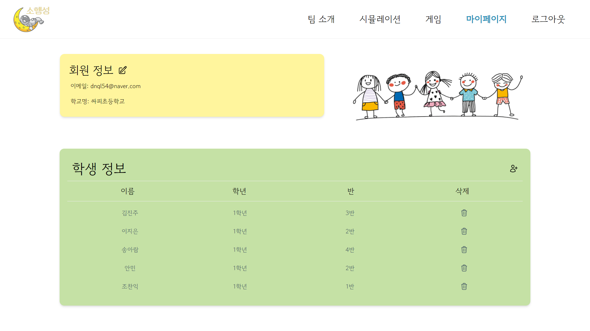
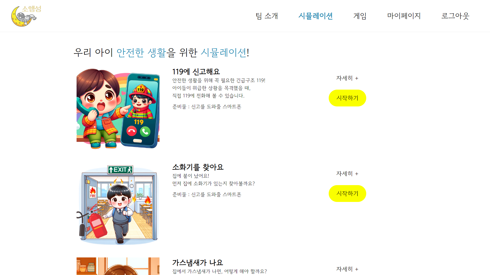
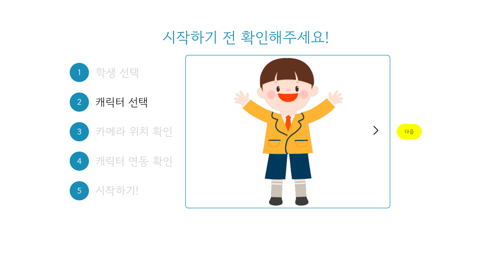
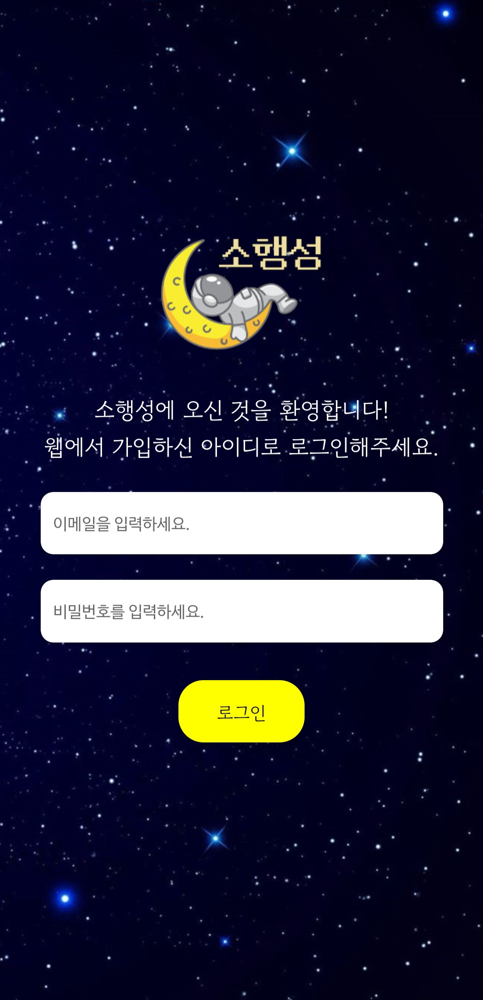
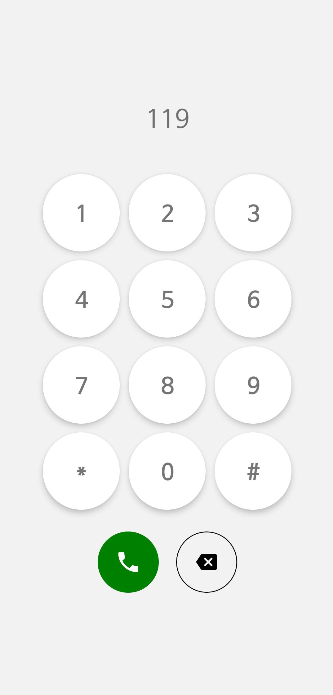
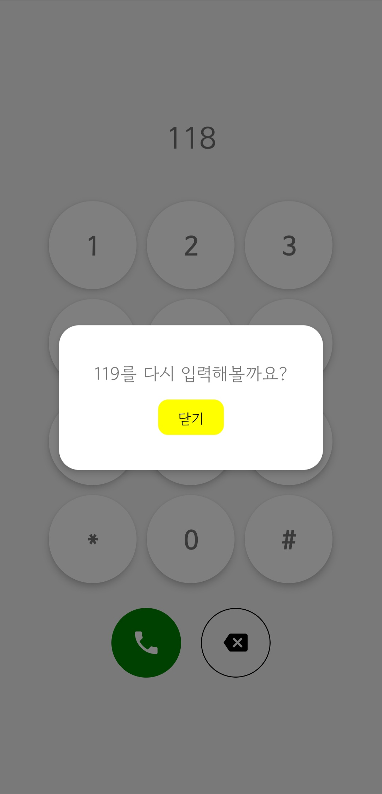
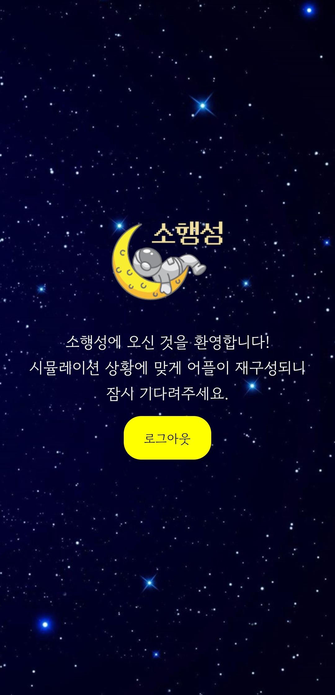
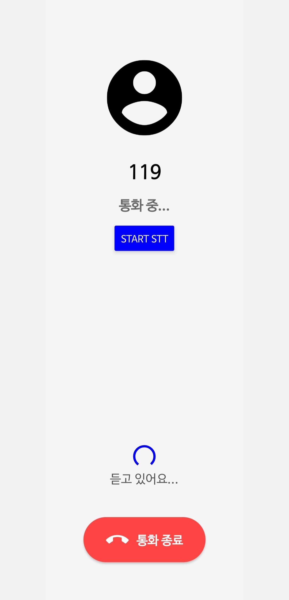

 

 

# ⭐ 작은 행동으로 성장하는 우리 아이, 소행성 ⭐

**안전한 생활**을 위해 꼭 필요한 긴급구조 119 시뮬레이션부터,  
분리수거, 양치질과 같은 **생활에 꼭 필요한** 지식까지.  
지금 당장 **소행성** 탐사를 떠나보세요!

### 🚀 소행성만의 특별한 기능 🚀

    1. 글로만 배우던 내용을 **직접** 체험할 수 있어요!
    2. **모션 인식**을 통해 시뮬레이션에 몰입할 수 있어요.
    3.

## 📚 목차 📚

#### [1️⃣개요](#개요)

#### [2️⃣팀 소개](#팀-소개-✨)

#### [3️⃣기획배경 및 타겟](#기획배경-및-타겟-🎯)

#### [4️⃣파트별 기능구현 소개](#파트별-기능구현-소개)

#### [5️⃣서비스화면](#서비스화면-💻)

#### [6️⃣사용기술스택](#사용기술스택)

#### [7️⃣시스템아키텍쳐](#시스템-아키텍쳐)

#### [8️⃣산출물](#산출물)

#### [9️⃣협업툴](#협업툴)

 

## 개요

#### 기간 : 2023.10.09 ~ 2023.11.17

#### SSAFY 9기 자율 PJT - 모션 인식 시뮬레이션

 

## 팀 소개 ✨

|   **NAME**   |                                              서정빈                                              |                                              김민국                                              |                                              박근창                                              |                                              양지혜                                              |                                              위효선                                              |                                              조찬익                                              |
| :----------: | :----------------------------------------------------------------------------------------------: | :----------------------------------------------------------------------------------------------: | :----------------------------------------------------------------------------------------------: | :----------------------------------------------------------------------------------------------: | :----------------------------------------------------------------------------------------------: | :----------------------------------------------------------------------------------------------: |
| **PROFILE**  |  |  |  |  |  |  |
| **POSITION** |                                            [Position]                                            |                                            [Position]                                            |                                            [Position]                                            |                                            [Position]                                            |                                            [Position]                                            |                                            [Position]                                            |

 

## 기획배경 및 타겟 🎯

### 기획배경

    1. 글로만 배우는 안전교육의 한계
    2. 체험, 실습형 안전교육 필요성 대두
    3. 능동적 학습을 통해 생활에 필수적인 지식 습득

### 타겟

    방과 후 소규모 학생들이 모여있는 돌봄교실

### 서비스 소개 💢

    서비스 소개

 

## 사용기술스택

| Tech         | Stack                |
| ------------ | -------------------- |
| **Language** | JavaScript, Java     |
| **Backend**  | Java SpringBoot      |
| **Frontend** | React, React-Native  |
| **Database** | MariaDB              |
| **Server**   | AWS EC2              |
| **DevOps**   | Git, Docker, Jenkins |

|     | **WEB**             | **APP**       | **Backend**  | **CI/CD** | **Server** |
| --- | ------------------- | ------------- | ------------ | --------- | ---------- |
|     | - React             | - ReactNative | - MariaDB    | - Docker  | - AWS EC2  |
|     | - Tailwind CSS      |               | - SpringBoot | - Jenkins |            |
|     | - styled-components |               |              | - Nginx   |            |

## 시스템아키텍쳐

 

 

## 서비스화면 💻

### 메인페이지

|                         소행성                          |
| :-----------------------------------------------------: |
|  |

### 회원관리

|                     로그인                     |                     회원가입                     |
| :--------------------------------------------: | :----------------------------------------------: |
|  |  |

### 마이페이지

|                     마이페이지                     |                          회원정보수정                           |                          학생등록                           |
| :------------------------------------------------: | :-------------------------------------------------------------: | :---------------------------------------------------------: |
|  |  |  |

### 콘텐츠 목록

|                       시뮬레이션                       |                       게임                       |
| :----------------------------------------------------: | :----------------------------------------------: |
|  |  |

### 기기연결 및 연결확인

|                    기기연결 가이드                     |                     OTP                     |                    기기연결 확인                     |
| :----------------------------------------------------: | :-----------------------------------------: | :--------------------------------------------------: |
|  |  |  |

### 시뮬레이션 디테일 💢

|                     119에 신고해요                      |
| :-----------------------------------------------------: |
|  |

### 시뮬레이션 플레이 💢

|                          인트로                          |                     아웃트로                     |
| :------------------------------------------------------: | :----------------------------------------------: |
|  |  |

|                     정답                     |                     오답                     |
| :------------------------------------------: | :------------------------------------------: |
|  |  |

### APP

|                     로그인                      |                     키패드                      |                     오답                      |
| :---------------------------------------------: | :---------------------------------------------: | :-------------------------------------------: |
|  |  |  |

|                     메인                      |                     전화중                      |                     로딩                      |
| :-------------------------------------------: | :---------------------------------------------: | :-------------------------------------------: |
|  |  |  |

### 팀소개 💢

|                      우리는 소행성                      |
| :-----------------------------------------------------: |
|  |

## 산출물

#### [자율PJT*광주\_2반\_C203*발표자료.pptx](./exec/) (\*.pptx)

#### [포팅 매뉴얼](./exec/포팅메뉴얼.pdf) (\*.pdf)

#### [소행성 앱](./exec/images/screenshot/APP_QR.jpg) (\*.apk)

## 협업툴
