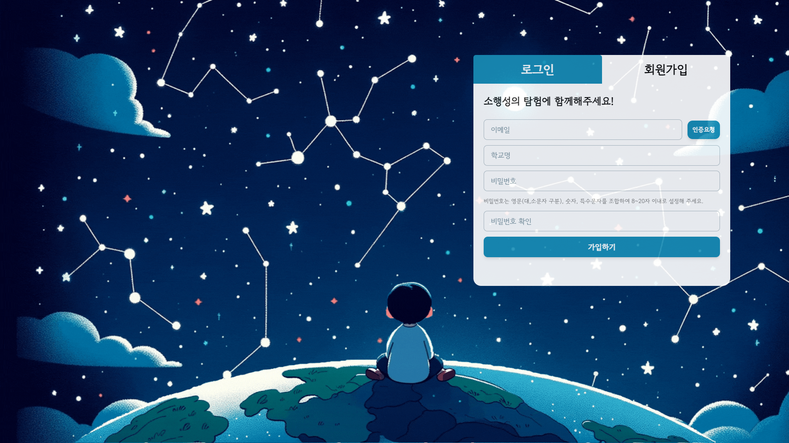
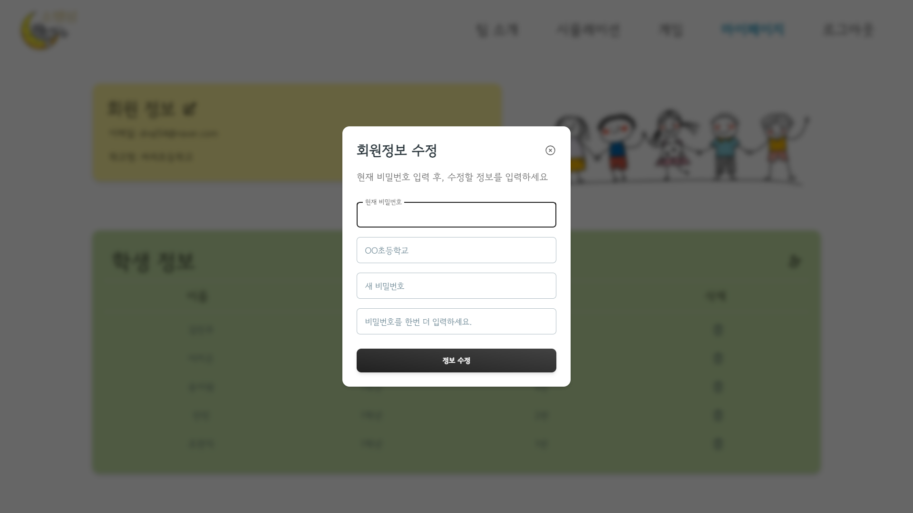
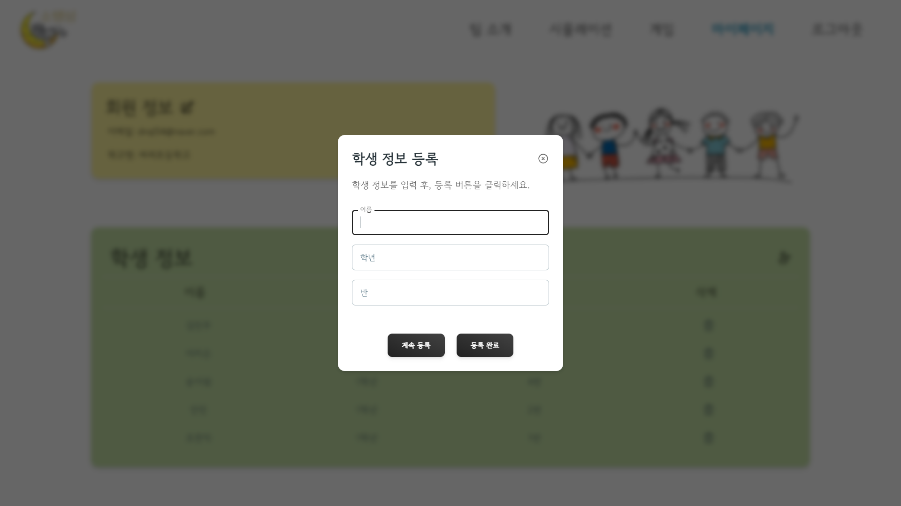
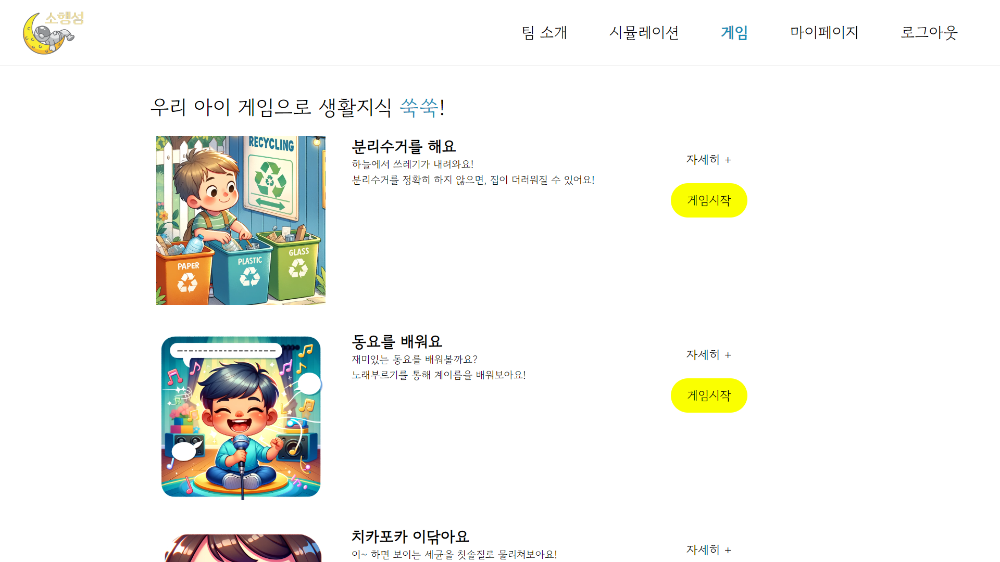
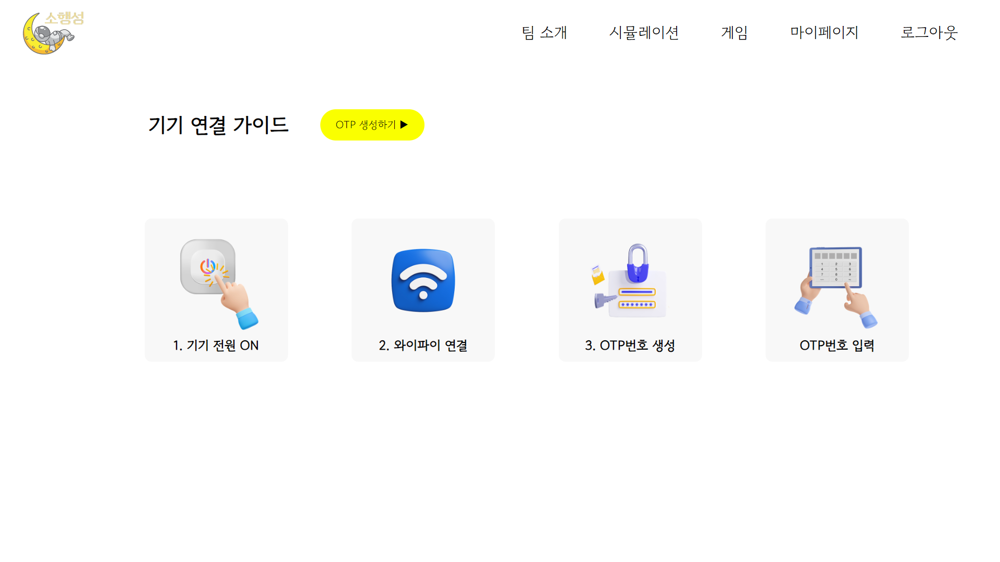
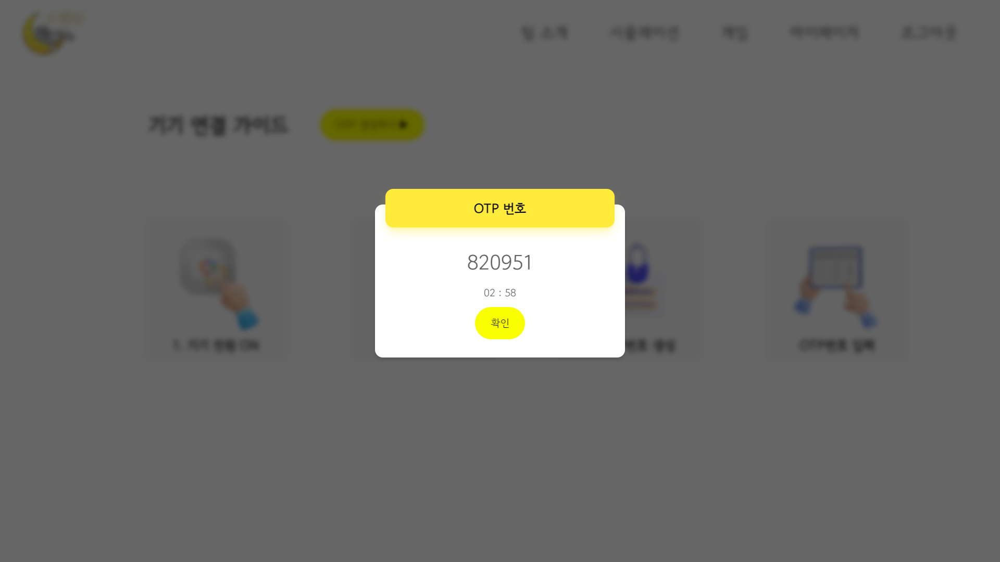
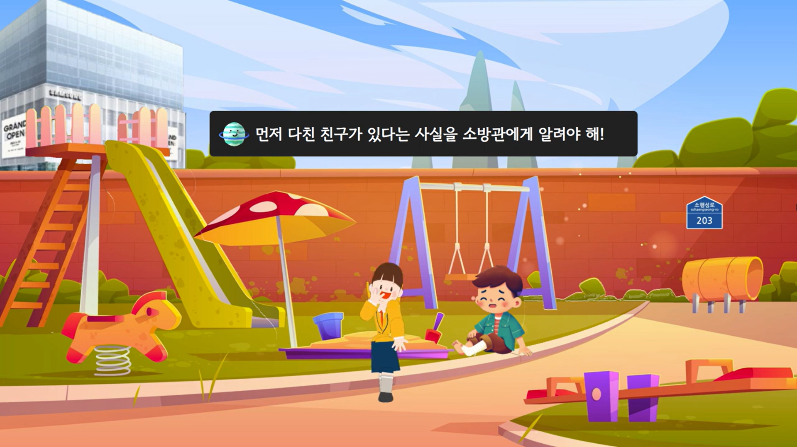
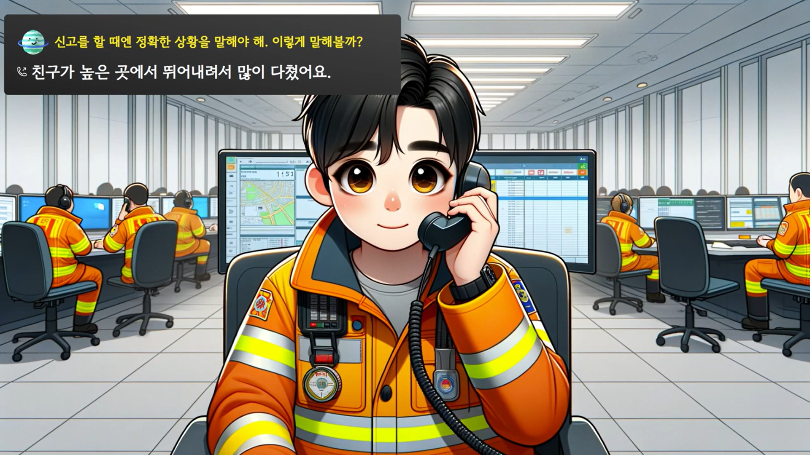
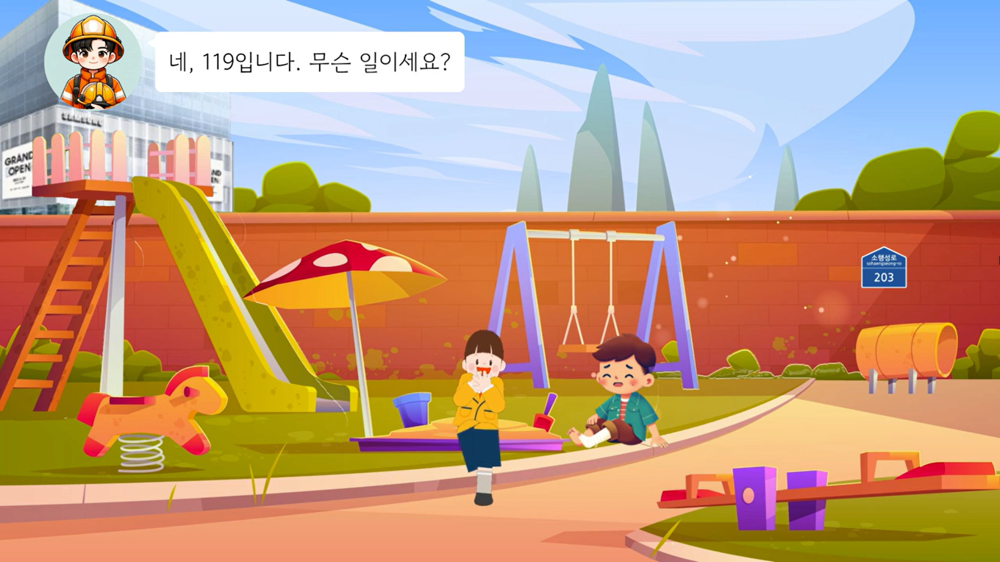
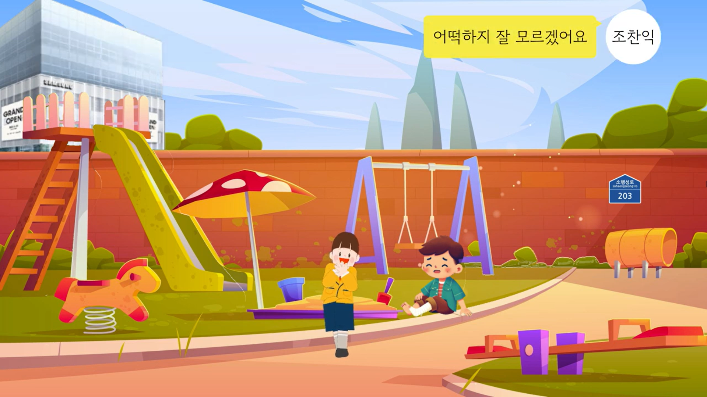

 

 

# ⭐ 작은 행동으로 성장하는 우리 아이, 소행성 ⭐

**아이게게는 꼭 알려주어야 할 여러가지 생활의 지혜가 있습니다.**

**안전한 생활**을 위해 꼭 필요한 긴급구조 119 시뮬레이션부터,  
분리수거, 양치질과 같은 **생활에 꼭 필요한** 지식까지.  
지금 당장 **소행성** 탐사를 떠나보세요!

### 🚀 소행성만의 특별한 기능 🚀

    1. 교과서에서 배우던 내용을 직접 체험할 수 있어요!
    2. 모션 인식을 통해 시뮬레이션에 몰입할 수 있어요.
    3. 실시간 소켓연결과 STT(Speach-to-Text), TTS(Text-to-speech)를 통해 다양한 상황을 자연스럽게 시뮬레이션 할 수 있어요!

## 📚 목차 📚

#### [1️⃣ 개요](#개요)

#### [2️⃣ 팀 소개](#팀-소개)

#### [3️⃣ 기획배경 및 타겟](#기획배경-및-타겟)

#### [4️⃣ 파트별 기능구현 소개](#파트별-기능구현-소개)

#### [5️⃣ 서비스화면](#서비스화면)

#### [6️⃣ 사용기술스택](#사용기술스택)

#### [7️⃣ 시스템아키텍쳐](#시스템-아키텍쳐)

#### [8️⃣ 산출물](#산출물)

#### [9️⃣ 협업툴](#협업툴)

 

## 개요

#### 프로젝트 기간 : 2023.10.09 ~ 2023.11.17

#### SSAFY 9기 자율 PJT - IoT 프로젝트 : 모션 인식 시뮬레이션

 

## 팀 소개

|   **NAME**   |                                              서정빈                                              |                                              김민국                                              |                                              박근창                                              |                                              양지혜                                              |                                              위효선                                              |                                              조찬익                                              |
| :----------: | :----------------------------------------------------------------------------------------------: | :----------------------------------------------------------------------------------------------: | :----------------------------------------------------------------------------------------------: | :----------------------------------------------------------------------------------------------: | :----------------------------------------------------------------------------------------------: | :----------------------------------------------------------------------------------------------: |
| **PROFILE**  |  |  |  |  |  |  |
| **POSITION** |                                            TeamLeader                                            |                                       Simulation/WebSocket                                       |                                             HardWare                                             |                                          Simulation/App                                          |                                          Simulation/Web                                          |                                          Simulation/Web                                          |

 

## 기획배경 및 타겟

### 기획배경

    1. 글로만 배우는 안전교육의 한계
    2. 체험, 실습형 안전교육 필요성은 계속 증가
    3. 능동적 학습으로 생활에 필수적인 지식을 쑥쑥!

### 타겟층

    서비스 이용층 : 초등학교 1,2학년 (방과 후 소규모 학생들이 모여있는 돌봄교실)

### 서비스 소개 

    1. 시뮬레이션 콘텐츠 선정
    2. 캐릭터 연동
    3. 모션인식을 통한 시뮬레이션 진행
    4. 웹소켓
    5. 어플과 실시간 연동
    6. 

 

## 파트별 기능구현 소개

**Backend**
 

    - 회원가입, 로그인, JWT토큰,SpringSecurity, 회원정보 수정, 비밀번호 수정
    - 학생 등록
    - 인증메일
    - REDIS
    - WebSocket
    - S3에 업로드된 콘텐츠url 관리
    - OTP 인증
    - 시뮬레이션 히스토리 관리

**Frontend - WEB**
 

    - 회원가입, 로그인 페이지
        - 비밀번호 오류시 Alert
        - 정확한 이메일 형식이 아닐 때 error메세지
    - 메인페이지
        - 앱 다운로드 QR 모달
    - 콘텐츠 리스트, 디테일 페이지
    - 마이페이지
    - 팀소개

    

**Frontend - APP**
 

**Hardware - raspi**
 

    - OTP 입력 페이지
        - OTP 인증
    - web 상태 check 페이지
        - redis를 통해 웹 상태 확인
    - 시뮬레이션 cam 페이지
        - 카메라 화면을 소켓으로 서버에 전송
    - 시뮬레이션 start 페이지
        - posenet을 통해 관절 좌표 redis로 서버에 전송
    - 서보모터
        - 상체의 중심좌표를 기준으로 서보모터 회전

**Hardware - server**
 

    - 연결된 기기와 소켓 통신
    - 캐릭터 이미지 변환
        - redis로 받아온 관절 좌표를 통해 분할된 이미지 변환(multiprocessing으로 속도 향상)

## 사용기술스택

|     | **WEB**             | **APP**       | **Backend**  | **CI/CD** | **Server** | **Hardware** |
| --- | ------------------- | ------------- | ------------ | --------- | ---------- | ---------- |
|     | - React             | - React-Native | - MariaDB    | - Docker  | - AWS EC2  | - Raspberrypi  |
|     | - Tailwind CSS      |               | - SpringBoot | - Jenkins |            | - Python  | 
|     | - styled-components |               |              | - Nginx   |            | - Posenet  |
|     |                     |               |              |           |            | - Tpu |

## 시스템아키텍쳐

 

 

## 서비스화면

### 메인페이지

|                          소행성                          |
| :------------------------------------------------------: |
|  |

### 회원관리

|                     로그인                      |                     회원가입                      |
| :---------------------------------------------: | :-----------------------------------------------: |
|  |  |

### 마이페이지

|                     마이페이지                      |                           회원정보수정                           |                           학생등록                           |
| :-------------------------------------------------: | :--------------------------------------------------------------: | :----------------------------------------------------------: |
|  |  |  |

### 콘텐츠 목록

|                        시뮬레이션                        |                        게임                        |
| :------------------------------------------------------: | :------------------------------------------------: |
|  |  |

### 기기연결 및 연결확인

|                     기기연결 가이드                     |                     OTP                      |                     기기연결 확인                     |
| :-----------------------------------------------------: | :------------------------------------------: | :---------------------------------------------------: |
|  |  |  |

### 시뮬레이션 디테일 💢

|                     119에 신고해요                      |
| :-----------------------------------------------------: |
|  |

### 시뮬레이션 플레이

|                           인트로                           |                           아웃트로                           |
| :--------------------------------------------------------: | :----------------------------------------------------------: |
|  |  |

|                           지시문                           |                           오답                           |
| :--------------------------------------------------------: | :------------------------------------------------------: |
|  |  |

|                           소방관                           |                           사용자                           |
| :--------------------------------------------------------: | :--------------------------------------------------------: |
|  |  |

### APP

|                     로그인                      |                     키패드                      |                     오답                      |
| :---------------------------------------------: | :---------------------------------------------: | :-------------------------------------------: |
|  |  |  |

|                     메인                      |                     전화중                      |                     로딩                      |
| :-------------------------------------------: | :---------------------------------------------: | :-------------------------------------------: |
|  |  |  |

### 팀소개 💢

|                      우리는 소행성                      |
| :-----------------------------------------------------: |
|  |

## 산출물

#### [자율PJT*광주\_2반\_C203*발표자료.pptx](./exec/) (\*.pptx)

#### [포팅 매뉴얼](./exec/포팅메뉴얼.pdf) (\*.pdf)

#### [소행성 앱](./exec/images/screenshot/APP_QR.jpg) (\*.apk)

## 협업툴
